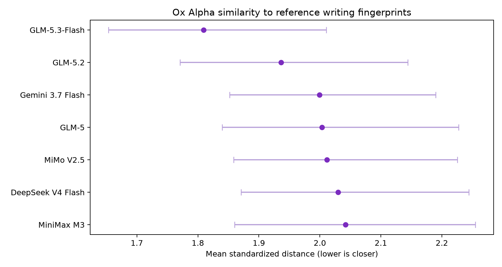

# Stealth-Eye

A reproducible toolkit for behavioral fingerprinting of anonymous AI model endpoints using paired-prompt stylometry.

---

## 1. Problem & Approach

When new models appear behind opaque API endpoints, you cannot inspect weights, training data, or provider infrastructure. The only observable signal is output behavior under controlled prompts.

**Stealth-Eye** enables you to test any unknown stealth model (`xyz`, `abc`, etc.) against candidate reference models under identical prompts:

- **460 Deterministic Features**: Computes hashed character n-grams, function-word rates, structural measures, discourse-marker rates, punctuation rates, and morphology measures.
- **Reference-Only Normalization**: Standardizes features, removes prompt main effects, and constructs centroids using reference model outputs only (zero target data leakage).
- **Separability Controls**: Evaluates reference leave-one-prompt-out accuracy to confirm candidates are distinguishable before ranking the target.
- **Bootstrap Stability**: Runs 4,000 prompt resamples to compute bootstrap win rates and verify ranking robustness.

---

## 2. Setup Guide

Stealth-Eye requires Python 3.9+ with `numpy` and `matplotlib`.

### Installation

```bash
# Clone the repository
git clone https://github.com/ItsKaiwenDu/Stealth-Model-Fingerprint-Lab.git
cd Stealth-Eye

# Install dependencies
pip install -r script/requirements.txt
```

### API Keys (Optional, for Automated Collection)
```bash
# For OpenRouter
export OPENROUTER_API_KEY='your-openrouter-api-key'

# For OpenAI or compatible endpoints
export PROVIDER_API_KEY='your-provider-api-key'
```

---

## 3. How to Test a Stealth Model

Follow this workflow to fingerprint any new target model against reference candidates (see [**`protocol.md`**](protocol.md) for full step-by-step guidance):

### 1. Scaffold a New Study Directory
```bash
python3 script/new_study.py data/my-stealth-study
```

### 2. Configure Candidates & Prompts
In `data/my-stealth-study/`:
- **`manifest.csv`**: Set 1 target model (`xyz`) and 2+ reference candidates (`candidate_a`, `candidate_b`, ...).
- **`models.json`**: Map each source ID to its API model string and generation parameters.
- **`prompts.md`**: Define prompts (minimum 8 for screening, 20+ recommended; prompt bank available in [`data/prompts.md`](data/prompts.md)).

### 3. Collect Model Responses
```bash
# Collect responses across all configured sources and prompts
python3 script/collect_chat_completions.py \
  --study data/my-stealth-study \
  --all-prompts \
  --all-sources \
  --workers 4
```

### 4. Validate & Run Analysis
```bash
# 1. Verify dataset completeness and prompt intersection
python3 script/analyze.py --study data/my-stealth-study validate

# 2. Run 460-feature stylometry ranking and generate report
python3 script/analyze.py --study data/my-stealth-study run
```

All generated tables, predictions, and visualization charts are written to `data/my-stealth-study/results/`.

---

## 4. Repository Structure

The repository is organized into three directories and three root files:

```text
Stealth-Eye/
├── example/
│   └── ox-alpha/                      # Proof of reliability: Ox Alpha -> GLM-5.3 case study
│       ├── study.json                 # Study metadata
│       ├── manifest.csv               # Model roles and display names
│       ├── models.json                # Model endpoints and parameters
│       ├── prompts.md                 # 12-prompt evaluation battery
│       ├── experiment_log.md          # Collection log and reasoning notes
│       ├── case_study.md              # Retrospective case study writeup
│       ├── data/                      # Raw text answers and audit metadata
│       └── results/                   # Generated reports, tables, and plots
├── script/
│   ├── analyze.py                     # Deterministic stylometry analysis CLI
│   ├── collect_chat_completions.py    # OpenAI-compatible collection entrypoint
│   ├── collect_openrouter.py          # Resumable multi-worker collector
│   ├── new_study.py                   # Study scaffold generator
│   └── requirements.txt               # Dependencies
├── data/
│   ├── template/                      # Clean starter template for new studies
│   └── prompts.md                     # Master 30-prompt battery bank
├── LICENSE
├── protocol.md                        # Step-by-step testing protocol guide
└── README.md
```

---

## 5. Proof of Reliability: Ox Alpha $\rightarrow$ GLM-5.3-Flash

To demonstrate that the methodology works on real-world anonymous endpoints, this repository retains the **Ox Alpha** case study as a proof of reliability.

During initial experimentation, Stealth-Eye was piloted against OpenRouter's anonymous `stealth/ox-alpha` endpoint prior to the public naming of **GLM-5.3-Flash**. The stylometry screen pointed unanimously to GLM-5.3 as the closest candidate. When ZhipuAI subsequently announced GLM-5.3-Flash, the endpoint was confirmed to be that exact model.

### Preserved Case Study Results

| Rank | Reference Candidate | Mean Distance | Bootstrap Win Rate (4,000 runs) | Prompt Votes |
|:---:|:---|:---:|:---:|:---:|
| **1** | **GLM-5.3-Flash** | **1.8094** | **100.0%** | **11 / 11** |
| 2 | GLM-5.2 | 1.9363 | 0.0% | 0 / 11 |
| 3 | Gemini 3.7 Flash | 1.9995 | 0.0% | 0 / 11 |
| 4 | GLM-5 | 2.0036 | 0.0% | 0 / 11 |
| 5 | MiMo V2.5 | 2.0116 | 0.0% | 0 / 11 |
| 6 | DeepSeek V4 Flash | 2.0299 | 0.0% | 0 / 11 |
| 7 | MiniMax M3 | 2.0423 | 0.0% | 0 / 11 |

- **Reference Control Accuracy**: 72.7% (separability check confirmed candidate models were distinguishable under this prompt battery).
- **Outcome**: GLM-5.3 held a 6.6% distance advantage over GLM-5.2 with unanimous prompt votes and a 100% bootstrap win rate.



> [!NOTE]
> All preserved data, logs, and artifacts for this proof of reliability are located in [`example/ox-alpha/`](example/ox-alpha/). You can inspect the complete setup in [Case Study Writeup](example/ox-alpha/case_study.md).

---

## 6. Limitations & Caveats

- **Relative Ranking, Not Identity**: Proximity to a candidate indicates stylometric similarity; it cannot establish shared weights, fine-tune relationships, or backend identity.
- **Candidate Universe**: Stealth-Eye can only evaluate models provided in `manifest.csv`. If the true origin model is omitted, it will identify the closest among the available candidates.
- **Reasoning Controls**: Incompatible reasoning parameters across providers can affect output length and style. Differences should be recorded in `experiment_log.md`.

---

## License

This project is licensed under the MIT License — see the [LICENSE](LICENSE) file for details.
