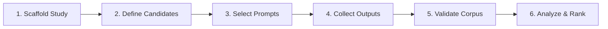

# Stealth-Eye Testing Protocol

A step-by-step operational guide for fingerprinting unknown or stealth AI endpoints against reference candidates using paired-prompt stylometry.

---

## Workflow Overview



---

## Step 1: Scaffold a New Study

Create an isolated study directory using the built-in generator:

```bash
python3 script/new_study.py data/my-stealth-study
```

This creates the standard study directory structure under `data/my-stealth-study/`:
```text
data/my-stealth-study/
├── study.json         # Title and metadata
├── manifest.csv       # Source ID, role, display names
├── models.json        # Endpoint model strings and request settings
├── prompts.md         # Prompt battery (starts with 8-prompt starter)
├── experiment_log.md  # Collection notes, dates, anomalies
├── data/              # Collected outputs (raw text and metadata)
└── results/           # Generated reports, metrics, and plots
```

---

## Step 2: Configure Candidates & Model Settings

### 1. `manifest.csv`
Define exactly **one `target`** (the unknown model) and **at least two `reference` models** (known candidate models):

```csv
source_id,role,display_name
unknown_target,target,Mystery-Model-X
candidate_a,reference,Model-A-v1
candidate_b,reference,Model-B-v2
candidate_c,reference,Model-C-v1
```

> [!TIP]
> Include plausible alternatives, adjacent versions, and suspected base checkpoints. Do not test only distant models.

### 2. `models.json`
Specify the endpoint and generation settings for each `source_id`:

```json
{
  "unknown_target": {
    "model": "stealth/mystery-x",
    "max_tokens": 16000,
    "temperature": 0.7,
    "reasoning": {"effort": "high", "exclude": true}
  },
  "candidate_a": {
    "model": "provider/model-a-v1",
    "max_tokens": 16000,
    "temperature": 0.7,
    "reasoning": {"effort": "high", "exclude": true}
  }
}
```

> [!IMPORTANT]
> Keep generation parameters (temperature, top_p, token caps, reasoning effort) as identical as possible across all sources. Record any vendor-enforced discrepancies in `experiment_log.md`.

---

## Step 3: Select or Customize Prompt Battery

Edit `prompts.md` in your study directory.

- **Minimum for screening**: 8 matched prompts.
- **Recommended for stable evaluation**: 20+ matched prompts.
- Master prompt bank available in [`data/prompts.md`](data/prompts.md) (contains 30 structured prompts across diverse genres: fiction, technical post-mortems, ethical arguments, policy memos, and explanations).

Format each prompt under an `### <prompt_id>` header:

```markdown
### p01 — constrained fiction

Write a self-contained literary story of 700–900 words about...
```

---

## Step 4: Collect Outputs

Collect single-turn responses using OpenRouter or any OpenAI-compatible API:

### OpenRouter
```bash
export OPENROUTER_API_KEY='your-key-here'
python3 script/collect_chat_completions.py \
  --study data/my-stealth-study \
  --all-prompts \
  --all-sources \
  --workers 4
```

### Other OpenAI-Compatible Endpoint
```bash
export PROVIDER_API_KEY='your-key-here'
python3 script/collect_chat_completions.py \
  --study data/my-stealth-study \
  --all-prompts \
  --all-sources \
  --base-url 'https://api.provider.com/v1/chat/completions' \
  --api-key-env PROVIDER_API_KEY
```

> [!NOTE]
> The collector is resumable. It skips prompts already present in `data/raw/` unless `--overwrite` is specified. Only final visible answers are saved.

---

## Step 5: Validate Dataset Integrity

Before analyzing, verify that all sources completed the same prompt intersection:

```bash
python3 script/analyze.py --study data/my-stealth-study validate
```

Validation checks:
- Source word counts and document completeness.
- Number of common prompt IDs across all reference and target models.
- Flags short/empty outputs or unmatched prompts.

---

## Step 6: Run Fingerprint Analysis

Execute the 460-feature stylometry pipeline:

```bash
python3 script/analyze.py --study data/my-stealth-study run
```

Outputs written to `data/my-stealth-study/results/`:
- `report.md`: Markdown summary report with rankings and confidence tier.
- `summary.json`: Machine-readable results and metrics.
- `predictions.csv`: Per-prompt nearest reference distance calculations.
- `confusion.csv`: Reference leave-one-prompt-out confusion matrix.
- `target_similarity.png`: Distance comparison plot.
- `rarity_violin.png`: Stylistic feature distributions.

---

## Step 7: Interpret the Results

Evaluate the results in the following order:

### 1. Reference Control Accuracy (Separability)
- **$\ge 70\%$**: References are distinguishable under these prompts. Target ranking is meaningful.
- **$< 70\%$**: References cannot be separated reliably. Result status is downgraded.

### 2. Distance Margin & Bootstrap Win Rate
- **Mean Distance**: Lower distance indicates closer stylistic proximity in standardized residual space.
- **Bootstrap Win Rate (4,000 resamples)**: Measures how consistently the top candidate wins across subsets of prompts.
- **Prompt Votes**: Number of individual prompts where the reference was ranked #1.

### 3. Status Labels

| Status | Thresholds | Interpretation |
|---|---|---|
| `INTERPRETABLE` | $\ge 20$ matched prompts, $\ge 70\%$ reference control accuracy, stable winner | Strong behavioral proximity under tested protocol. |
| `SCREENING ONLY` | $8–19$ matched prompts or minor control instability | Directional indicator; indicates which models to test on a larger confirmation battery. |
| `NOT INTERPRETABLE` | $< 8$ matched prompts or control accuracy $< 70\%$ | Inconclusive; candidate set is inseparable or prompt count too small. |

---

## Safeguards & Caveats

1. **Ranking $\neq$ Identity**: A result proves behavioral proximity among the supplied candidates. It does not establish model weights, training lineage, or provider identity.
2. **Candidate Universe**: The analysis cannot detect candidates omitted from `manifest.csv`.
3. **No Target Contamination**: Target outputs are never used in feature scaling, standardization, or centroid construction.
